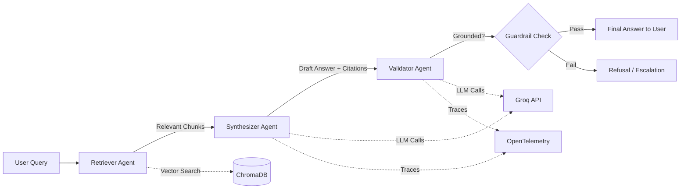

# DocTrust

**Enterprise RAG Copilot with Guardrails & Observability**

DocTrust is a multi-agent Retrieval-Augmented Generation (RAG) system that doesn't just answer questions from enterprise documents — it verifies that every answer is grounded in retrieved evidence, blocks unsafe or unsupported responses, and tracks its own quality, cost, and latency in real time.

Most RAG demos stop at "it answers questions." DocTrust goes further by treating **trust as a first-class feature**: every response passes through a validation agent before it reaches the user, every query is scored for faithfulness and relevance, and every LLM call is instrumented for cost and performance visibility.

> **Status:** 🚧 In Progress — core pipeline functional, guardrails and eval harness under active development.

---

## Why DocTrust

Enterprises adopting LLM-powered document assistants face three recurring problems:

1. **Hallucination risk** — models confidently answer with information not present in the source documents.
2. **No visibility** — teams have no way to measure answer quality, cost, or latency in production.
3. **No safety net** — sensitive data (PII) or out-of-scope queries get answered instead of refused.

DocTrust addresses all three with a validation-first architecture rather than bolting these concerns on after the fact.

---

## Architecture



**Pipeline stages:**

| Agent | Responsibility |
|---|---|
| **Retriever** | Searches the vector store for the most relevant document chunks for a given query |
| **Synthesizer** | Drafts an answer strictly from retrieved context, returning structured JSON (`answer`, `citations`, `confidence`) |
| **Validator** | Cross-checks the draft answer against retrieved context to catch unsupported claims before release |
| **Guardrails** | Independent rule + LLM-judge layer that blocks PII leakage, refuses out-of-scope queries, and enforces a minimum confidence threshold |

---

## Features

- **Multi-agent orchestration** with CrewAI — retrieval, synthesis, and validation as distinct, coordinated agents
- **Structured outputs** — every agent response is Pydantic-validated JSON, not free-text
- **Guardrails** — PII detection, out-of-scope refusal, and hallucination gating before any answer reaches the user
- **Automated evaluation** — RAGAS-based scoring of faithfulness, answer relevance, and context precision against a fixed test set, acting as a CI-style quality gate
- **Observability** — OpenTelemetry instrumentation on every retrieval and LLM call, capturing latency, token usage, and estimated cost per query
- **Cost-aware routing** — simple queries are routed to a smaller/faster model; ambiguous ones escalate to a larger model
- **Fully free to run** — built entirely on open-source tooling and free-tier APIs (see [Tech Stack](#tech-stack))

---

## Tech Stack

| Layer | Tools |
|---|---|
| Agent orchestration | CrewAI |
| LLM inference | Groq API (Llama 3.1 8B / Llama 3.3 70B) |
| Embeddings | `sentence-transformers` (local) |
| Vector store | ChromaDB |
| Structured validation | Pydantic |
| Guardrails | Custom rule-based + LLM-judge checks |
| Evaluation | RAGAS |
| Observability | OpenTelemetry |
| API layer | FastAPI |
| Containerization | Docker |
| Demo UI | Streamlit |

---

## Project Structure

```
doctrust/
├── src/
│   ├── agents/            # Retriever, synthesizer, validator agent definitions
│   ├── guardrails/        # PII detection, refusal logic, confidence gating
│   ├── eval/              # RAGAS harness and test query sets
│   └── observability/     # OpenTelemetry instrumentation
├── data/                  # Source documents for ingestion
├── tests/                 # Unit and integration tests
├── requirements.txt
└── README.md
```

---

## Getting Started

### Prerequisites
- Python 3.10+
- A free [Groq API key](https://console.groq.com)
- Docker (optional, for containerized run)

### Setup

```bash
git clone https://github.com/Apoo3va/doctrust.git
cd doctrust
python -m venv venv
source venv/bin/activate    # Windows: venv\Scripts\activate
pip install -r requirements.txt
```

Set your API key:
```bash
export GROQ_API_KEY="your-key-here"
```

Ingest documents and run:
```bash
python src/ingest.py --path data/
python src/main.py
```

Or run the API server:
```bash
uvicorn src.api:app --reload
```

---

## Evaluation Results

*(Populated once the eval harness completes a full run — placeholder below shows the intended format.)*

| Metric | Score |
|---|---|
| Faithfulness | TBD |
| Answer Relevance | TBD |
| Context Precision | TBD |
| Avg. Latency | TBD |
| Avg. Cost / Query | TBD |

---

## Roadmap

- [x] Multi-agent retrieval + synthesis pipeline
- [x] Structured JSON outputs with Pydantic
- [ ] Validator agent hallucination gating
- [ ] PII and out-of-scope guardrails
- [ ] RAGAS evaluation harness
- [ ] OpenTelemetry tracing and cost logging
- [ ] Model routing (cost optimization)
- [ ] Public Streamlit demo deployment

---

## License

MIT

---

## Author

Built by [Apoorva](https://github.com/Apoo3va) as an exploration of production-grade, trust-first RAG system design.
