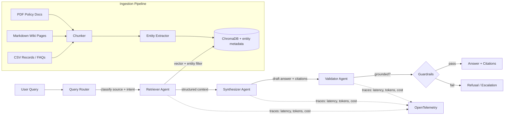

# DocTrust

**Enterprise RAG Copilot with Guardrails & Observability**

DocTrust is a multi-agent, multi-source enterprise assistant that retrieves, synthesizes, and validates answers from heterogeneous internal documents — PDFs, wikis, and structured records — while proving that every response is grounded, safe, and cost-tracked before it reaches the user.

Most RAG demos stop at "it answers questions from one folder of similar files." DocTrust goes further: it routes queries across multiple document types, enriches retrieval with extracted entity metadata, and treats **trust as a first-class feature** — every response passes through a validation agent, every query is scored for faithfulness and relevance, and every LLM call is instrumented for cost and performance visibility.

> **Status:** 🚧 In Progress — core pipeline under active development.

---

## Why DocTrust

Enterprises adopting LLM-powered document assistants face four recurring problems:

1. **Fragmented knowledge** — relevant information lives across different formats (PDFs, wikis, spreadsheets), and most RAG demos only handle one.
2. **Shallow retrieval** — pure vector similarity misses structured signals like policy names, departments, or dates that a real enterprise search system should use.
3. **Hallucination risk** — models confidently answer with information not present in the source documents.
4. **No visibility or safety net** — teams can't measure answer quality, cost, or latency in production, and sensitive data or out-of-scope queries often get answered instead of refused.

DocTrust addresses all four with a validation-first, multi-source architecture rather than bolting these concerns on after the fact.

---

## Architecture



**Pipeline stages:**

| Stage | Responsibility |
|---|---|
| **Ingestion** | Loads PDF, Markdown, and CSV sources; chunks content and tags each chunk with `source_type` metadata |
| **Entity Extractor** | Pulls structured entities (policy name, department, date, category) from each chunk via LLM, stored as metadata alongside the vector embedding |
| **Query Router** | Classifies incoming queries to determine which source(s) are relevant before retrieval runs |
| **Retriever Agent** | Performs hybrid retrieval — vector similarity combined with entity metadata filtering/boosting |
| **Synthesizer Agent** | Drafts an answer strictly from retrieved context, returning structured JSON (`answer`, `citations`, `confidence`, `source_type`) |
| **Validator Agent** | Cross-checks the draft answer against retrieved context to catch unsupported claims before release |
| **Guardrails** | Independent rule + LLM-judge layer blocking PII leakage, refusing out-of-scope queries, and enforcing a minimum confidence threshold |

---

## Features

- **Multi-source enterprise search** — ingests and queries across PDFs, Markdown wikis, and structured CSV records through a single unified interface
- **Knowledge engineering layer** — entity extraction (policy names, departments, dates, categories) enriches retrieval beyond pure vector similarity
- **Context engineering** — structured, filtered context is passed between agents rather than raw text dumps, improving grounding and reducing hallucination
- **Multi-agent orchestration** with CrewAI — retrieval, synthesis, and validation as distinct, coordinated agents
- **Structured outputs** — every agent response is Pydantic-validated JSON, not free-text
- **Guardrails** — PII detection, out-of-scope refusal, and hallucination gating before any answer reaches the user
- **Automated evaluation** — RAGAS-based scoring of faithfulness, answer relevance, and context precision, segmented by source type to validate routing correctness
- **Observability** — OpenTelemetry instrumentation on every stage (routing, retrieval, entity extraction, agent calls), capturing latency, token usage, and estimated cost per query
- **Cost-aware routing** — simple queries are routed to a smaller/faster model; ambiguous ones escalate to a larger model
- **Fully free to run** — built entirely on open-source tooling and free-tier APIs (see [Tech Stack](#tech-stack))

---

## Tech Stack

| Layer | Tools |
|---|---|
| Agent orchestration | CrewAI |
| LLM inference | Groq API (Llama 3.1 8B / Llama 3.3 70B) |
| Embeddings | `sentence-transformers` (local) |
| Vector store | ChromaDB (with entity metadata) |
| Entity extraction | Structured LLM output (Pydantic schema) |
| Structured validation | Pydantic |
| Guardrails | Custom rule-based + LLM-judge checks |
| Evaluation | RAGAS |
| Observability | OpenTelemetry |
| API layer | FastAPI |
| Containerization | Docker |
| Demo UI | Streamlit |

---

## Project Structure

```
doctrust/
├── src/
│   ├── ingestion/          # PDF, Markdown, CSV loaders + chunking
│   ├── knowledge/          # Entity extraction and metadata enrichment
│   ├── routing/            # Query classification / source routing
│   ├── agents/             # Retriever, synthesizer, validator agent definitions
│   ├── guardrails/         # PII detection, refusal logic, confidence gating
│   ├── eval/               # RAGAS harness and test query sets
│   └── observability/      # OpenTelemetry instrumentation
├── data/
│   ├── pdf/                # Sample policy documents
│   ├── wiki/               # Sample markdown pages
│   └── records/            # Sample CSV records
├── tests/                  # Unit and integration tests
├── requirements.txt
└── README.md
```

---

## Getting Started

### Prerequisites
- Python 3.10+
- A free [Groq API key](https://console.groq.com)
- Docker (optional, for containerized run)

### Setup

```bash
git clone https://github.com/Apoo3va/doctrust.git
cd doctrust
python -m venv venv
source venv/bin/activate    # Windows: venv\Scripts\activate
pip install -r requirements.txt
```

Set your API key:
```bash
export GROQ_API_KEY="your-key-here"
```

Ingest documents (runs chunking + entity extraction across all source types):
```bash
python src/ingestion/run.py --path data/
```

Run the pipeline:
```bash
python src/main.py
```

Or run the API server:
```bash
uvicorn src.api:app --reload
```

---

## Evaluation Results

*(Populated once the eval harness completes a full run — placeholder below shows the intended format.)*

| Metric | PDF Source | Wiki Source | CSV Source | Overall |
|---|---|---|---|---|
| Faithfulness | TBD | TBD | TBD | TBD |
| Answer Relevance | TBD | TBD | TBD | TBD |
| Context Precision | TBD | TBD | TBD | TBD |
| Avg. Latency | TBD | TBD | TBD | TBD |
| Avg. Cost / Query | TBD | TBD | TBD | TBD |

---

## Roadmap

- [ ] Multi-source ingestion (PDF, Markdown, CSV)
- [ ] Entity extraction and metadata enrichment
- [ ] Query router for source classification
- [ ] Multi-agent retrieval, synthesis, and validation pipeline
- [ ] Structured JSON outputs with Pydantic
- [ ] Guardrails: PII detection, out-of-scope refusal, confidence gating
- [ ] RAGAS evaluation harness, segmented by source type
- [ ] OpenTelemetry tracing and cost logging
- [ ] Cost-aware model routing
- [ ] Public Streamlit demo deployment

---

## License

MIT

---

## Author

Built by [Apoorva](https://github.com/Apoo3va) as an exploration of production-grade, trust-first, multi-source RAG system design.
