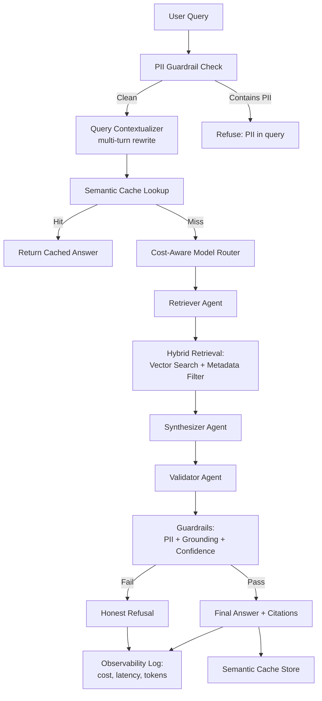

# DocTrust

**Enterprise RAG Copilot with Guardrails & Observability**

DocTrust is a multi-agent Retrieval-Augmented Generation (RAG) system that answers employee questions from a company's own documents — PDFs, wiki pages, and CSV records — while staying grounded in retrieved evidence, refusing to answer when it isn't confident, and tracking its own cost, latency, and quality over time.

It was built as a hands-on exploration of enterprise RAG concerns that go beyond a basic "chatbot over documents" demo: multi-source enterprise search, knowledge engineering, context engineering, multi-agent coordination, guardrails, automated evaluation, observability, and cost-aware model routing — all running entirely on free-tier infrastructure.

---

## Why this project

Most RAG tutorials stop at "retrieve chunks, stuff them in a prompt, call an LLM." Real enterprise deployments need more:

- Documents come from multiple inconsistent sources (PDFs, wikis, spreadsheets) with messy formatting and **genuinely conflicting information**.
- Answers need to be grounded and auditable, not just plausible-sounding.
- Systems need to be observable (cost, latency, token usage) and testable (automated quality evaluation, unit tests, CI).
- Free-tier LLM APIs come with real constraints (rate limits, model deprecations, inconsistent JSON output) that have to be engineered around, not assumed away.

DocTrust tackles all of this directly, using a small but deliberately messy and partially self-contradictory document set to stress-test the pipeline the way a real deployment would be stress-tested.

---

## Architecture


```mermaid
flowchart TD
    A[User Query] --> B[PII Guardrail Check]
    B -->|Clean| C[Query Contextualizer<br/>multi-turn rewrite]
    B -->|Contains PII| Z[Refuse: PII in query]
    C --> D[Semantic Cache Lookup]
    D -->|Hit| Y[Return Cached Answer]
    D -->|Miss| E[Cost-Aware Model Router]
    E --> F[Retriever Agent]
    F --> G[Hybrid Retrieval:<br/>Vector Search + Metadata Filter]
    G --> H[Synthesizer Agent]
    H --> I[Validator Agent]
    I --> J[Guardrails:<br/>PII + Grounding + Confidence]
    J -->|Pass| K[Final Answer + Citations]
    J -->|Fail| L[Honest Refusal]
    K --> M[Observability Log:<br/>cost, latency, tokens]
    L --> M
    K --> N[Semantic Cache Store]
```

**Pipeline stages:**

1. **PII Guardrail (fail-fast)** — queries containing emails, phone numbers, or ID-like numbers are rejected before any expensive LLM calls run.
2. **Query Contextualization** — follow-up questions in a multi-turn conversation are rewritten into standalone questions using conversation history, so "What about for interns?" becomes a fully-formed question.
3. **Semantic Cache** — near-duplicate queries (cosine similarity ≥ 0.92 on sentence embeddings) are served from a local cache instead of re-running the full pipeline.
4. **Cost-Aware Model Router** — short, single-part questions go to a cheaper/faster Groq model; longer, multi-clause questions route to a stronger model.
5. **Retriever Agent** — calls a hybrid retrieval tool combining vector similarity search (ChromaDB + `all-MiniLM-L6-v2` embeddings) with metadata filters derived from a keyword-based department/category router.
6. **Synthesizer Agent** — answers strictly from retrieved context, returning a structured JSON object with an answer, citations, and a self-reported confidence score.
7. **Validator Agent** — independently checks whether every claim in the synthesized answer is actually supported by the retrieved context, and can fail the answer if it finds unsupported or contradictory claims.
8. **Guardrails** — block the final answer if: the query or answer contains PII, the validator failed the grounding check, or confidence is below threshold. The user gets an honest "I don't know" instead of a confident wrong answer.
9. **Observability** — every query logs latency, token usage, estimated cost, and guardrail outcome, visualized in a Streamlit dashboard.

---

## A real finding: catching a cross-document conflict

The dataset intentionally contains a contradiction: a travel policy PDF states the domestic travel allowance is **INR 1800/day**, while a separate FAQ record states **INR 1500/day** — the kind of inconsistency that accumulates in real enterprise knowledge bases over time.

When asked *"What is the daily travel allowance for domestic trips?"*, the retriever correctly pulled both conflicting chunks. On one run, the synthesizer picked one figure, but the **validator agent caught the contradiction itself**:

> *"The claim that the daily travel allowance for domestic trips is INR 1800 contradicts the information in Chunk 1, which states the allowance is INR 1500... it is not fully grounded in the provided context."* → verdict: **fail**

Guardrails then blocked the answer, and the user received an honest refusal instead of a confidently wrong number. On another run, the synthesizer instead surfaced both figures explicitly with their sources. In neither case did the system silently present one conflicting value as fact — which is the actual point of having a validator and guardrails rather than relying on a single LLM call.

This also surfaced a separate, genuine bug during development: the retriever agent's iteration budget was initially capped too tightly (`max_iter=1`), which meant it successfully called the retrieval tool but then had zero iterations left to report the result, and a small model's fallback "final answer" became a non-answer refusal instead of the tool's actual output. Raising the budget to `max_iter=2` — enough to call the tool once and then report it, without allowing a second tool call — fixed this. It's a good example of a subtle, realistic failure mode in agentic pipelines: giving an agent too little room to finish its own task.

---

## Evaluation (RAGAS)

Answer quality is measured automatically with [RAGAS](https://github.com/explodinggradients/ragas) against a 10-question hand-written test set spanning all source types, run sequentially against Groq's free tier.

| Metric | Score |
|---|---|
| Faithfulness | 0.900 |
| Answer Relevancy | 0.675 |
| Context Precision | 0.833 |

All 30 metric computations (10 questions × 3 metrics) completed with zero missing or failed scores. Full per-question results are in [`eval_results.csv`](eval_results.csv).

---

## Features

- **Multi-source enterprise search** across PDF, Markdown, and CSV, with a keyword-based query router filtering by department and category alongside vector similarity.
- **Knowledge engineering**: LLM-based entity extraction tags every chunk with policy name, department, date, and category metadata at ingestion time.
- **Context engineering**: hybrid retrieval combining dense vector search with structured metadata filters, falling back to unfiltered search when a filter returns nothing.
- **Multi-agent coordination** (CrewAI): separate retriever, synthesizer, and validator agents with a sequential process, each with a narrow, auditable responsibility.
- **Guardrails**: PII detection (regex-based) on both query and answer, grounding/hallucination checks, and a confidence threshold — all enforced before an answer reaches the user.
- **Automated evaluation**: a RAGAS harness scoring faithfulness, answer relevancy, and context precision, with retry/backoff and sequential execution tuned for a free-tier rate limit.
- **Observability**: OpenTelemetry tracing, per-query cost estimation, and a Streamlit dashboard showing latency, cost, token usage, and guardrail pass rate over time.
- **Cost optimization**: a lightweight query-complexity router picks a cheaper model for simple questions and a stronger model for complex ones, plus a semantic cache that reuses answers for near-duplicate queries.
- **Multi-turn conversation memory**: follow-up questions are rewritten into standalone questions using recent conversation history.
- **Feedback loop**: thumbs up/down feedback on answers, stored and summarized via an API endpoint.
- **Structured logging**: every stage of the pipeline logs to both console and a persistent log file under a consistent namespace.
- **API authentication**: the FastAPI backend is protected by an API key header.
- **Tested and containerized**: 24 pytest unit tests covering chunking, PII detection, routing, and guardrail logic (zero API calls, runs in under a second), a Dockerfile for full containerized deployment, and a GitHub Actions workflow running the test suite on every push.

---

## Tech stack

| Layer | Technology |
|---|---|
| LLM | Groq API (free tier) — `openai/gpt-oss-20b` / `openai/gpt-oss-120b` |
| Multi-agent framework | CrewAI |
| Embeddings | `sentence-transformers` (`all-MiniLM-L6-v2`, local, free) |
| Vector store | ChromaDB (persistent, local) |
| API | FastAPI + Uvicorn |
| UI | Streamlit (chat interface + observability dashboard) |
| Evaluation | RAGAS |
| Observability | OpenTelemetry |
| Testing | Pytest |
| CI | GitHub Actions |
| Containerization | Docker |

Everything runs on free tiers — no paid API keys required.

---

## Project structure
Doctrust/
├── data/
│ ├── pdf/ # Policy documents (generated)
│ ├── wiki/ # Markdown knowledge base pages
│ └── records/ # CSV FAQ records
├── src/
│ ├── ingestion/ # Loaders, chunker, ingestion pipeline
│ ├── knowledge/ # Entity extraction schema + extractor
│ ├── routing/ # Department/category query router
│ ├── agents/ # CrewAI agents, tools, model router, contextualizer
│ ├── guardrails/ # PII detection, grounding/confidence guardrails
│ ├── observability/ # Tracing, semantic cache, feedback, logging, dashboard
│ ├── eval/ # RAGAS test set + evaluation harness
│ ├── api.py # FastAPI app
│ └── chat_app.py # Streamlit chat UI
├── tests/ # Pytest unit tests
├── .github/workflows/ # CI pipeline
├── Dockerfile
├── requirements.txt
└── eval_results.csv # Latest RAGAS evaluation output

---

## Running locally

```bash
python -m venv venv
venv\Scripts\activate          # Windows
pip install -r requirements.txt

# Set GROQ_API_KEY and DOCTRUST_API_KEY in a .env file

python src/ingestion/run.py --path data

uvicorn src.api:app --reload           # in one terminal
streamlit run src/chat_app.py          # in another
```

Run tests:

```bash
pytest tests/ -v
```

Run evaluation:

```bash
python src/eval/run_eval.py
```

Or run the whole thing in Docker:

```bash
docker build -t doctrust .
docker run -p 8000:8000 doctrust
```

---

## Known limitations

- The router's department/category matching is keyword-based rather than semantic, so some queries fall back to unfiltered vector search.
- The validator does not always catch cross-document conflicts — in some runs it surfaces both conflicting values, in others it blocks the answer outright, but it has never been observed confidently presenting one conflicting value as the sole truth.
- Confidence scores are self-reported by the synthesizer LLM rather than calibrated against a held-out set, so they should be read as a relative signal, not a calibrated probability.
- Running on free-tier Groq API limits means latency and occasional rate-limit retries under heavy load; the pipeline degrades gracefully with a friendly error message rather than crashing.

---

## License

MIT
